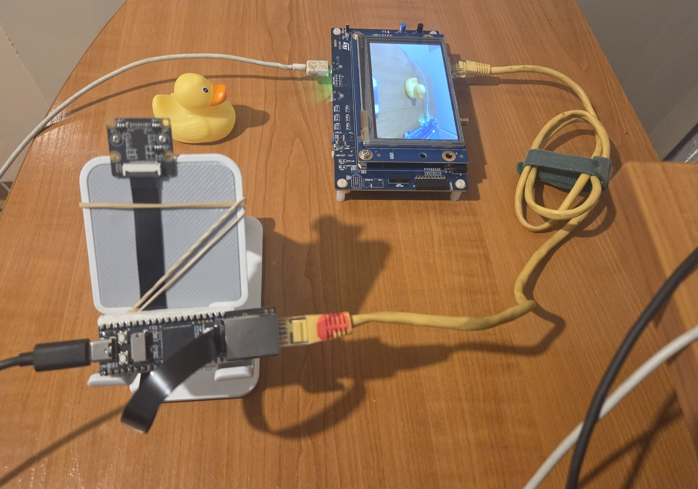
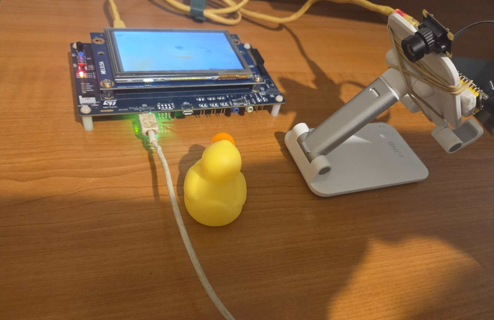

# Luckfox Pico Jpeg Stream Trial

A trial jpeg stream application for Linux running in user space, leveraging the hardware jpeg encoder present in the Rockchip RV1106G3 device. This project captures frames from a CSI camera, encodes them into MJPEG format, and streams them over a TCP network connection to a display device.



## 1. Project Location & Prerequisites

This project is designed to be built within the official Luckfox Pico SDK.

-   **Location**: `luckfox-pico/media/samples/rv1106_jpeg_stream_trial`

### Prerequisites

Before you can build this project, you must have the cross-compilation toolchain installed and configured for your development environment.

-   **Toolchain**: `arm-rockchip830-linux-xxx`
-   **Installation**: Please follow the official Luckfox Pico documentation to download, install, and configure the SDK and toolchain.

> **Note**: This project was developed and built using Windows Subsystem for Linux (WSL2).

## 2. Project Files and Folders

The project directory contains the following key files:

-   `rv1106_jpeg_stream_trial.c`: The main C source file. It uses the Rockchip Media Process Platform (MPP) to initialize the camera (VI), configure the hardware video encoder (VENC) for MJPEG, and manage the TCP socket for streaming data.
-   `Makefile`: The build script used to compile the application. It links against the necessary system and Rockchip libraries.
-   `deploy.bat` / `deploy.sh`: Simple scripts to automate deployment from Windows or Linux, respectively. They push the compiled binary to the device via `adb`, set executable permissions, and run the application.
-   `S99zluckfox_stream.sh`: An `init.d` startup script. When placed in `/etc/init.d/` on the device, it automatically starts the streaming application on boot. It handles network configuration and sets the `LD_LIBRARY_PATH` required by the Rockchip libraries.
-   `build/`: This directory is created during the build process and contains the final compiled executable.
-   `images/`: Contains images for this documentation.

## 3. Hardware and Setup




This project involves two main hardware components connected over an Ethernet network.

### Components

1.  **Luckfox Pico Pro Max**: The streaming device, featuring the Rockchip RV1106G3 SoC with integrated ISP and video encoders.
    -   **IP Address (Static)**: `192.168.100.50`
2.  **Camera**: A MIPI CSI 2-lane camera module (e.g., MISS001 5MP) connected to the CSI connector on the Luckfox board.
3.  **STM32H735-DK (Discovery Kit)**: The receiving device. It runs a TCP server application that listens for incoming JPEG frames and displays them on its 480x272 LCD.
    -   **IP Address (Static)**: `192.168.100.10`
    -   *Note: The firmware for the STM32 board is maintained in a separate repository.*

### Connection

The Luckfox Pico and the STM32H7 Discovery Kit are connected directly via an Ethernet cable or through a network switch. The Luckfox board initiates the TCP connection and streams encoded JPEG frames, each prefixed with a 4-byte length header (big-endian), to the listening STM32 board.

## 4. Software Overview

The application is a C program designed to run in user space on the embedded Linux system of the Luckfox Pico. It leverages the Rockchip Media Process Platform (MPP) to take full advantage of the RV1106's hardware capabilities for video processing. The software is multi-threaded, using POSIX threads (`pthreads`) to handle different tasks concurrently for efficient operation.
By default, the application is configured to stream at a resolution of 480x272, which is tailored to match the LCD screen size of the STM32H735-DK host.
 
The application's logic is primarily split between two main threads:

### Main Thread

The `main` function acts as the primary control thread. Its responsibilities include:

1.  **Initialization**: It parses command-line arguments, sets up a signal handler for graceful shutdown (`SIGINT`), and initializes all necessary hardware components.
2.  **Pipeline Configuration**: It configures the camera's video input (VI) and the hardware video encoder (VENC). Crucially, it **binds** the VI channel directly to the VENC channel. This creates a zero-copy hardware pipeline where the camera sensor data is fed directly to the JPEG encoder without involving the CPU.
3.  **Thread Management**: It spawns the dedicated streaming thread to handle network communication.
4.  **Supervision and Cleanup**: The main thread then waits for a termination signal. Upon receiving one, it coordinates a graceful shutdown by signaling the streaming thread to exit, unbinding the media pipeline, and releasing all system resources.

### Streaming Thread (`vi_venc_thread`)

This is a worker thread created using `pthread_create`. It runs in a continuous loop with a single, focused responsibility: streaming the video data.

1.  **Fetch Encoded Data**: The thread blocks until the hardware VENC has a complete JPEG frame ready. It then retrieves this encoded frame from the hardware buffer.
2.  **Network Management**: It manages the TCP socket connection to the STM32 receiver. If the connection is not established or is lost, it will automatically attempt to reconnect.
3.  **Data Transmission**: Once a connection is active, it sends the JPEG frame over the network. It first sends a 4-byte header containing the size of the frame, followed by the actual JPEG data. This allows the receiver to correctly parse the stream.

## 5. How to Build and Run

### 1. Build the Application

Navigate to the project directory from within your configured SDK environment and run `make`. This will compile the source code and place the final executable in the `build/` directory.

```bash
cd luckfox-pico/media/samples/rv1106_jpeg_stream_trial
make
```

### 2. Deploy and Run

The easiest way to deploy and run the application is by using the provided scripts. Ensure your Luckfox Pico is connected to your computer and accessible via `adb`.

-   **From Linux (or WSL2):**
    ```bash
    ./deploy.sh
    ```
-   **From Windows:**
    ```batch
    .\deploy.bat
    ```

These scripts automate the following steps:
1.  Pushes the compiled `rv1106_jpeg_stream_trial` binary to `/data/local` on the device.
2.  Sets executable permissions for the binary.
3.  Stops the default `rkipc` process to free up the camera hardware.
4.  Assigns the static IP address `192.168.100.50` to the `eth0` interface.
5.  Executes the application, which will then start streaming to the configured STM32 host.

## Disclaimer

> This project is provided "as-is," without any warranty of any kind, express or implied, including but not limited to the warranties of merchantability, fitness for a particular purpose, or non-infringement. The authors are not liable for any damages arising from the use of this project. Use this project at your own risk. By using this project, you agree to take full responsibility for any consequences, including but not to limited to hardware damage, loss of data, or other risks associated with the use of this project.
